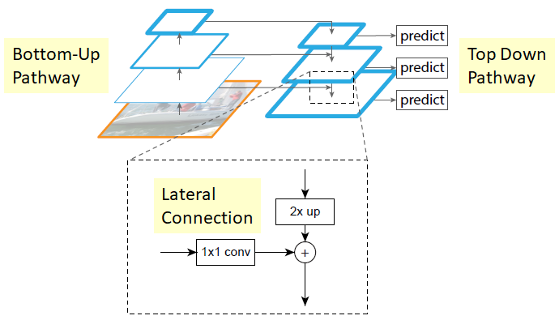

# Anchor-Free-Object-Detection-with-FCOS
 ## Introduction

 I have implemented a former State of Art Anchor Free single-stage object detector based on **FCOS (Fully-Convolutional One-Stage Object Detection)** https://arxiv.org/abs/1904.01355v5. The goal of this project is to detect specific object classes. My detector closely follows the FCOS design, but I made some adjustments to create a smaller model with different hyperparameters. I had to do this because I'm working with limited AWS resources. We train our network on **Pascal VOC dataset ** http://host.robots.ox.ac.uk/pascal/VOC/


We Implement **Feature Pyramid Networks for Object Detection** (https://arxiv.org/abs/1612.03144) from scratch and use that as the Neck for our Object Detector. We also implement a custom Prediction Head to work with this Network, along with Various Losses detailed as follows:




**Object classification**: FCOS uses Sigmoid Focal Loss, an extension of cross-entropy loss that deals with class-imbalance. FCOS faces a class imbalance issue because a majority of locations would be assigned “background”. If not handled properly, the model will simply learn to predict “background” for every location. We Implement this loss from scratch


**Box regression**: The FCOS paper uses Generalized Intersection-over-Union loss to minimize the difference between predicted and GT LTRB deltas. We  implement this loss from scratch Again.


**Centerness regression**: Centerness predictions and GT targets are real-valued numbers in [0, 1], so FCOS uses binary cross-entropy (BCE) loss to optimize it. One may use an L1 loss, but BCE empirically works slightly better.

## Enviornment Setup
```
$ conda create --name myenv python=3.7
$ pip install -r requirements.txt
```
---
## Dataset
download the Pascal VOC 2007 Dataset using the following commands and bash script.
```
$ chmod +x Image Classification On Pascal VOC\download_data.sh
$ cd Image Classification On Pascal VOC
$ .\download_data.sh
```

## Training 
```
$ python3 train.py --overfit=False
```

## Inference
```
python3 train.py --inference 
```

##  Visualizations
### Feature Centers 
 
 
 

 ## Results and Inference 
 
 
 
 
 
 

 ## t-distributed stochastic neighbor embedding

 t-distributed stochastic neighbor embedding (t-SNE) is a statistical method for visualizing high-dimensional data by giving each datapoint a location in a two or three-dimensional map. It is based on Stochastic Neighbor Embedding originally developed by Sam Roweis and Geoffrey Hinton,where Laurens van der Maaten proposed the t-distributed variant.It is a nonlinear dimensionality reduction technique for embedding high-dimensional data for visualization in a low-dimensional space of two or three dimensions. Specifically, it models each high-dimensional object by a two- or three-dimensional point in such a way that similar objects are modeled by nearby points and dissimilar objects are modeled by distant points with high probability.

 We plot T-sne (https://en.wikipedia.org/wiki/T-distributed_stochastic_neighbor_embedding) to visualize the feature space of the network right before the head in a low dimensional 2D space. This helps us assess if the features were discriminative or if we need to incorporate a constrastive learning based strategy inorder to obtain more discriminative feature maps


 
